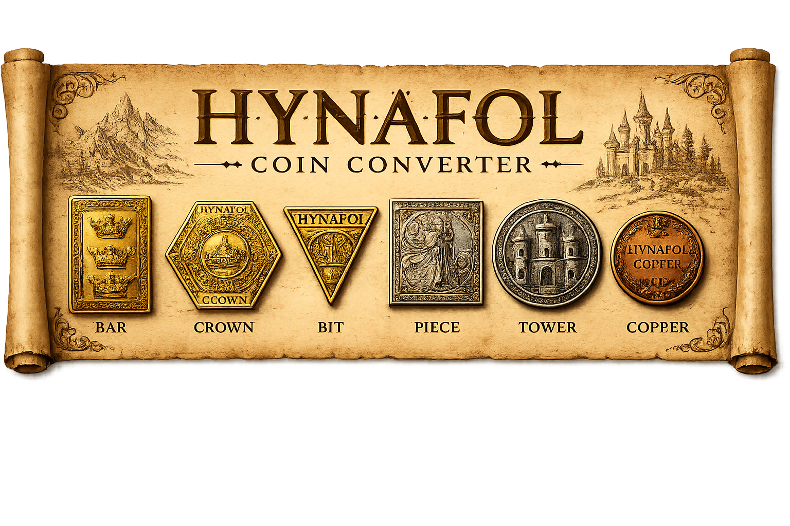

# Hynafol Coin Converter
### Hynafol Counting House Tools



A browser-based toolkit for converting currency, splitting treasury funds, calculating merchant prices, and planning unit upgrades in Hynafol, a live-action role-playing game.

I originally wrote a simple Python script for myself while volunteering at the Hynafol bank. People kept asking me for it, so I turned it into an easily accessible web app. What started as something to make my own banking shifts easier has grown into a collection of tools other players can use without installing anything.

Fantasy money is still money, and someone has to do the math.

## What It Does

Hynafol uses six currency denominations with alternating exchange rates. That makes counting a mixed pile of coins or splitting a treasury a little more involved than dividing dollars and cents.

This app handles those calculations and presents the results in the currency players actually use. It also includes tools for merchant transactions and unit upgrade planning, all organized into four tabs.

## Key Features

### Treasury

- Enter amounts using individual denomination fields or quick-entry text such as `1 bar 1 crown 5 towers`.
- Convert mixed currency into a total copper value.
- Collapse that total into the fewest coins using the largest denominations first.
- Split a treasury evenly among adventurers and show any leftover currency.
- Clear the ledger to start a new calculation.

Quick entry supports singular and plural names, plus abbreviations: `br` for bars, `cr` for crowns, `b` for bits, `p` for pieces, `t` for towers, and `c` for copper. When quick entry contains text, it takes priority over the individual currency fields.

### Merchant

- Enter an item's price in any combination of denominations.
- Multiply the price by the quantity being purchased.
- Display the total in copper and a readable coin breakdown.

### Utilities

- Calculate a percentage of a currency amount.
- Show a denomination's equivalent value in each smaller denomination.

### Unit Upgrade

- Select a unit and the quantity to create.
- Calculate the resources and prerequisite units needed.
- Account for units created in batches by rounding up to complete batches.
- Add multiple upgrades to a queue and combine their resource requirements into a shopping list.
- Copy the shopping list to the clipboard.
- Save the upgrade queue and last selection in the browser using `localStorage`.

The interface also includes responsive layouts for smaller screens and a fantasy-inspired design that fits the setting.

## Hynafol Currency System

| Denomination | Exchange Rate | Value in Copper |
| --- | --- | ---: |
| Copper | Base unit | 1 |
| Tower | 3 copper = 1 tower | 3 |
| Piece | 6 towers = 1 piece | 18 |
| Bit | 3 pieces = 1 bit | 54 |
| Crown | 6 bits = 1 crown | 324 |
| Bar | 3 crowns = 1 bar | 972 |

### Example: Splitting a Treasury

A treasury containing **1 bar and 1 crown** is worth **1,296 copper**.

Split among **47 adventurers**, each person receives **27 copper**, displayed as:

**1 piece and 3 towers**

That leaves **27 copper** on the counting table.

The app converts all denominations to copper before calculating, then converts the result back into coins. Equal shares use whole copper amounts, and any remainder is displayed separately. Percentage results round down to whole copper.

## Technologies Used

| Technology | How It Is Used |
| --- | --- |
| HTML5 | Page structure, forms, and tab content |
| CSS3 | Styling, responsive layouts, and the visual theme |
| JavaScript | Currency parsing, calculations, unit planning, and interface updates |
| Browser `localStorage` | Saving the unit upgrade queue and last selection |
| Clipboard API | Copying the combined shopping list |
| Google Fonts | Cinzel and Cormorant Garamond typography |
| Git and GitHub | Version control and sharing the source code |

The current application keeps its HTML, CSS, and JavaScript together in `index.htm`. It runs in the browser without a backend, database, framework, or build step.

Python was used for the original personal tool. The current web application uses JavaScript for its calculations.

## How to Run It

### Open It Locally

1. Download this repository using **Code → Download ZIP**.
2. Extract the ZIP file.
3. Keep `index.htm` and `hynafol-banner.png` in the same folder.
4. Open `index.htm` in a modern browser.

No package installation is required.

### Clone the Repository

If you have Git installed:

```bash
git clone https://github.com/Elletnah/Hynafol-Coin-Converter.git
cd Hynafol-Coin-Converter
```

Then open `index.htm` in your browser.

### Optional Local Server

If you have Python installed, you can serve the project locally:

```bash
python -m http.server 8000
```

Open:

```text
http://localhost:8000/index.htm
```

The filename is `index.htm`, so include it in the address.

Google Fonts requires an internet connection. Saved upgrade plans belong to the browser and origin where they were created, so they do not automatically transfer between devices or between a local file and a hosted site. Clipboard copying depends on browser permissions and is best used through localhost or HTTPS.

## Project Evolution

### A Personal Python Tool

The project began as a simple Python script I used personally at the Hynafol bank. I needed a quicker way to handle the game's currency conversions during banking shifts.

### A Web App Other Players Could Use

People kept asking me for the tool, so I rebuilt it as a web app using HTML, CSS, and JavaScript. That made it easier to share and use directly in a browser.

### A Broader Counting House Toolkit

The app grew beyond basic conversion to include treasury splitting, merchant totals, percentages, and denomination breakdowns. I also refined the layout and styling to make it easier to navigate on smaller screens.

### Unit Upgrade Planning

The current version brings unit upgrade planning into the same interface. It calculates prerequisite resources, handles batch quantities, and combines queued upgrades into a saved shopping list.

Earlier web versions remain in the repository so the project's development is visible. `index.htm` contains the current version.

## Repository Files

| File | Purpose |
| --- | --- |
| `index.htm` | Current application, labeled Version 5 in the source |
| `hynafol-banner.png` | Application banner |
| `Version1.html` | Earlier web version |
| `V2` | Earlier web version |
| `Version 3` | Earlier web version |
| `Version 4` | Earlier web version |
| `LICENSE` | MIT license |

## What This Project Shows

I'm proud of this project because it came from a problem I actually needed to solve, and other people found it useful enough to ask for it.

It brings together skills relevant to software development, IT support, and data analysis:

- **Software development:** Turning game rules into reusable functions, updating the interface through the DOM, and managing saved browser data.
- **IT support:** Understanding a user's practical problem and making a tool easier to access, use, and reset during real tasks.
- **Data analysis:** Normalizing mixed denominations into a common unit, calculating totals and percentages, tracking remainders, and aggregating resource requirements.
- **Iterative problem-solving:** Expanding a personal script into a browser-based toolkit as its use grew.

The most rewarding part has been taking something I made for myself and turning it into something useful for my community.

## Author

Created by **Shantelle “Elle” Andrews**

[GitHub Profile](https://github.com/Elletnah)

## License

This project is licensed under the [MIT License](LICENSE).
